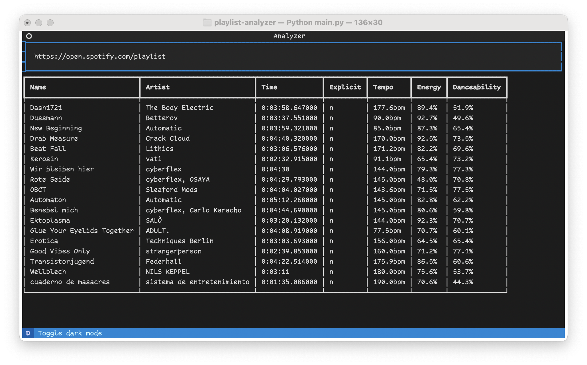

# playlist-analyzer

a simple spotify playlist analyzer.



this tool takes a spotify playlist/album link as input and returns details for each song:
- name of the song
- artist of the song
- length of the song
- whether or not the song is explicit (y/n)
- the tempo of the song in bpm
- the energy (made-up metric by spotify)
- the danceability of the song (made-up metric by spotify)

# installation

to install this application, the following needs to be done:

1. set up a project with spotify [here](https://developer.spotify.com/dashboard/applications). The parameters here are irrelevant. i've set the redirect uri to `http://localhost:8080`.
2. clone this repository: 
    ```sh
    git clone https://github.com/phntxx/playlist-analyzer
    ```
3. copy `config.template.yml` to `config.yml`: 
    ```sh
    cp config.template.yml config.yml
    ```
4. edit `config.yml`. add the client id, client secret and redirect uri you got in step 1.
5. create a new python virtual environment and enter it:
    ```sh
    python3 -m venv venv
    source ./venv/bin/activate
    ```
6. install all dependencies:
    ```sh
    python3 -m pip install -r requirements.txt
    ```
7. run `playlist-analyzer`:
    ```sh
    python3 main.py
    ```